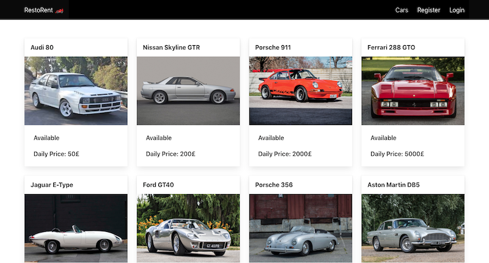

# SEI Project: Restful API

## Overview 

Restorent is a car review application built as a homework over the course of the weekend. It utilises user and car models 



---
## Technologies Used

* HTML5
* SCSS and Bulma CSS framework
* JavaScript
* MongoDB
* Mongoose
* Express
* React.js
* Node.js
* Insomnia
* Axios
* Git/GitHub

---
## Deployment

Web version can be found on [Heroku](https://rustorrent.herokuapp.com/)

---
## Getting Started

Clone the repository and run on your machine. 

Install the packages listed in the package.json file by running the following terminal command:
```
$ yarn
```
Run the seeds file to seed the DB.
```
$ yarn seed
```
Run the app with the following command:
```
$ yarn start
```
Start your browser and navigate to following address:

http://localhost:4000/

---
## Usage

This application allows user to perform the following actions:
* Login. Login, register and profile edit uses the same React component with different props passed to it.
* Register
* View own profile
* Edit own Profile
* Create vehicle.
* Edit vehicle.
* Post review of the vehicle.
* Delete own review of the vehicle.
* Delete created vehicle.
* Logout.

---
## Future Improvements

Since the app has been developed during the course of two days, the member experience through error handling may need improving.
I also planned implementing the car availability calendar for short rental bookings among the the site members.
